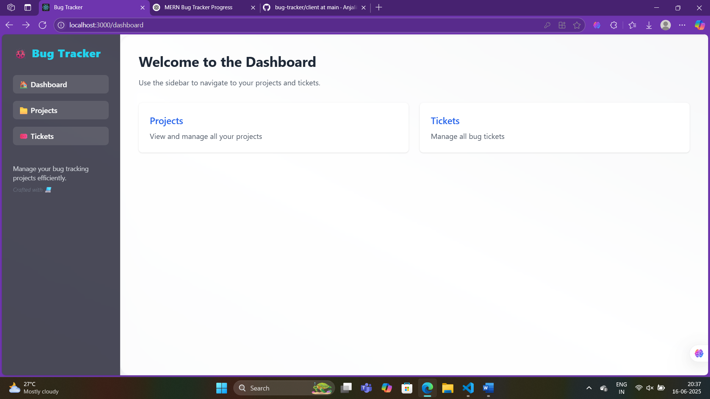
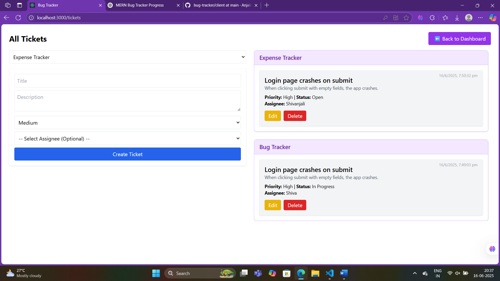
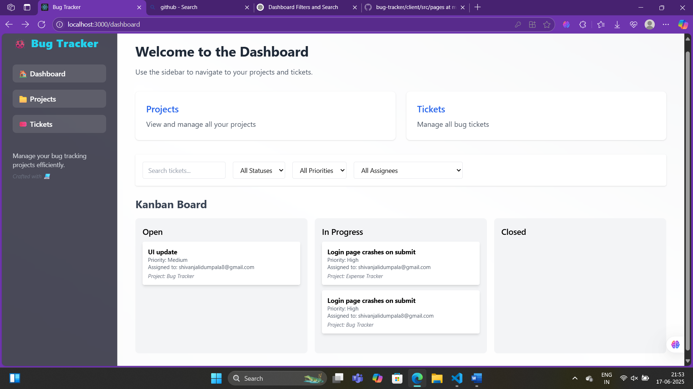
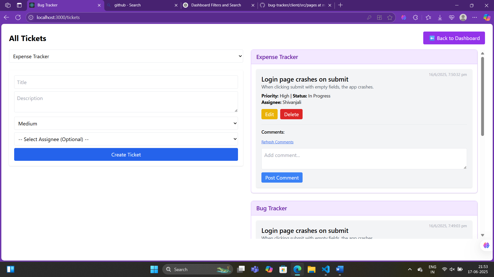
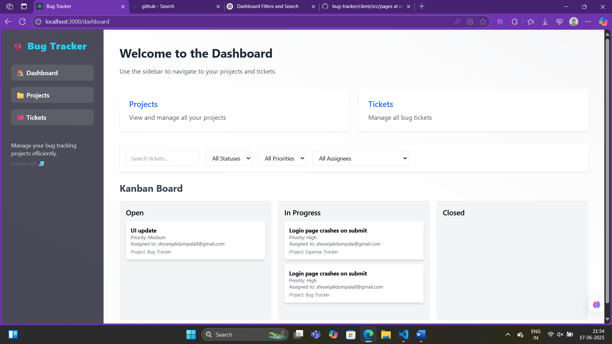
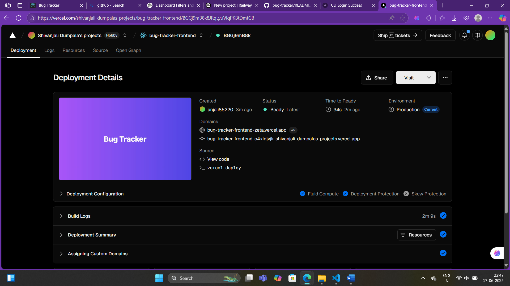
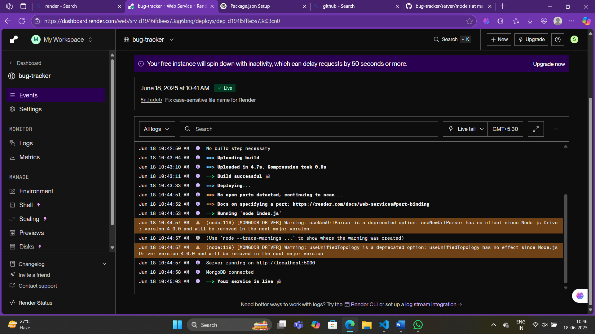

# 🐛 Bug Tracker Web App

A full-stack issue/bug tracker built using the MERN stack (MongoDB, Express, React, Node.js). Inspired by Jira & Linear, this tool helps teams report, assign, track, and resolve bugs via a Kanban workflow.

---

## 🚀 Features

- ✅ JWT-based User Authentication  
- 🧑‍🤝‍🧑 Project and Team Management  
- 🐞 Create & Assign Issues (Tickets)  
- 🏷️ Filter by status, priority, assignee  
- 📋 Drag & drop Kanban Board (To Do, In Progress, Done)  
- 💬 Comments & Collaboration  
- 📎 Optional screenshot uploads  

---

## 📁 Tech Stack

**Frontend:**  
- React.js  
- Tailwind CSS  
- react-beautiful-dnd  
- Axios  

**Backend:**  
- Node.js + Express.js  
- MongoDB + Mongoose  
- JWT + bcrypt  

---

## 📂 Folder Structure

- `/backend`  
  - `models/` — Mongoose schemas (User, Project, Ticket)  
  - `routes/` — Express API routes (auth, projects, tickets)  
  - `controllers/` — Business logic for API endpoints  
  - `middleware/` — Auth and error handling middleware  
  - `index.js` — Express server setup and route mounting  

- `/frontend`  
  - `src/components/` — React components (Login, Dashboard, Kanban, etc.)  
  - `src/pages/` — Page-level components (Home, Projects, Tickets)  
  - `src/context/` — React Context for state management  
  - `src/utils/` — Utility functions and API calls  
  - `tailwind.config.js` — Tailwind CSS configuration  

---

## 🛠️ Development Progress

### ✅ Day 1 - Splash Screen and Home Page Setup
- Splash screen with animated title and timed auto-navigation  
- Landing Home page with Register/Login CTA  
- Routing from splash → home → login/register

#### Screenshots  
  
  

---

### ✅ Day 2 - Login and Register Pages
- Fully styled login/register forms with validation  
- JWT authentication integration with protected routes  
- Session management via localStorage  

#### Screenshots  
  
  

---

### ✅ Day 3 - Project Management Features
- MongoDB Project schema with title, description, and teamMembers  
- Backend CRUD APIs and frontend forms for create, view, and delete  
- Sidebar navigation with Projects section  
- Updated dashboard layout with clickable project tiles

#### Screenshots  
  
  

---

### ✅ Day 4 - Ticket Model and API Integration
- Ticket schema: title, description, priority, status, assignee, projectId  
- API routes for ticket CRUD and project-based filtering  
- Assignee dropdown auto-populated with project members  
- Protected routes using JWT middleware  

---

### ✅ Day 5 - Ticket UI and Functionalities
- Frontend ticket creation form  
- Project-based ticket filtering  
- Ticket list displays title, status, assignee, and project name  
- Toast notifications for success and error handling  
- Modal-based ticket update and delete confirmation  

---

### ✅ Day 6 - UI Enhancements and Dashboard
- Fully responsive sidebar dashboard with improved layout  
- Modern color scheme and hover animations  
- Unified design for Projects and Tickets pages  
- Breadcrumbs and better button feedback  
- Updated `Projects.jsx` and `TicketsPage.jsx` with consistent UX

#### Screenshots  
  
  

---

### ✅ Day 7 - Bug Fixing and GitHub Integration
- Removed redundant “Go to Dashboard” buttons and moved navigation into layout  
- Cleaned up state handling and form resets  
- Final testing using Postman  
- Repository pushed to GitHub with complete backend/frontend  

---

### ✅ Day 8 - Kanban Board with Drag-and-Drop  
- Implemented a Kanban board with columns: To Do, In Progress, Done  
- Used `react-beautiful-dnd` for drag-and-drop functionality  
- Ticket status updates on drop, persisted to database via API  

#### Screenshots  
  

---

### ✅ Day 9 - Comment System  
- Added a Comment model with ticketId, userId, text, timestamp  
- Users can post and view comments under each ticket  
- Comments are displayed with usernames and timestamps  

#### Screenshots  
  

---

### ✅ Day 10 - Ticket Filtering and Search  
- Added dropdown filters for status, priority, assignee  
- Implemented search bar for real-time keyword filtering  
- Combined filtering and search for better UX  


### ✅ Day 11 - Final UI Polishing  
- Removed inline ticket edit fields; used modal-based edit forms  
- Improved confirmation modals for delete/update/assign  
- Enhanced visual layout for project selectors and ticket lists  

#### Screenshots  
  

---

### ✅ Day 12 - Deployment  
- Backend deployed on [Render](https://bug-tracker-nb3y.onrender.com)  
- Frontend deployed on [Vercel]( https://bug-tracker-744d5cyid-shivanjali-dumpalas-projects.vercel.app)  
- Connected to [MongoDB Atlas](https://cloud.mongodb.com/v2/684316bd8746901bb57fe8c8#/clusters/detail/Cluster1)  
- Environment variables (.env) secured in both frontend and backend  

#### Screenshots  
  
  

---

## 📦 Installation and Running

```bash
# Clone the repository
git clone https://github.com/Anjali85220/bug-tracker.git
cd mern-bug-tracker

# Backend
cd server
npm install
npm run dev

# Frontend
cd client
npm install
npm start
