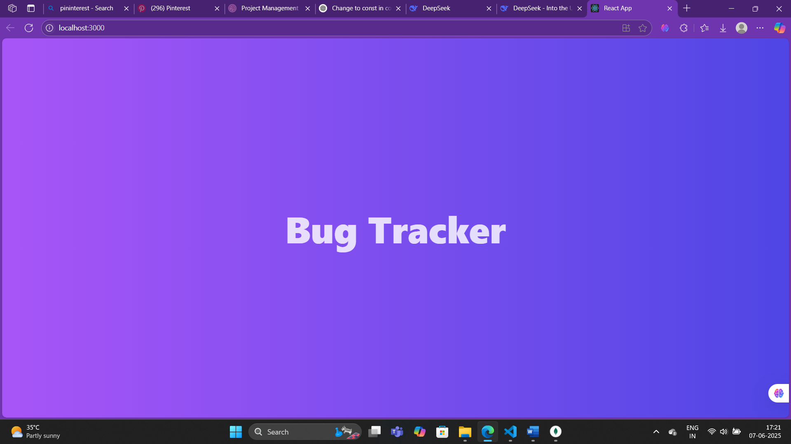
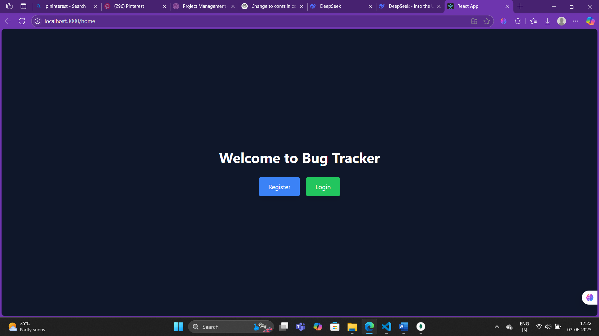
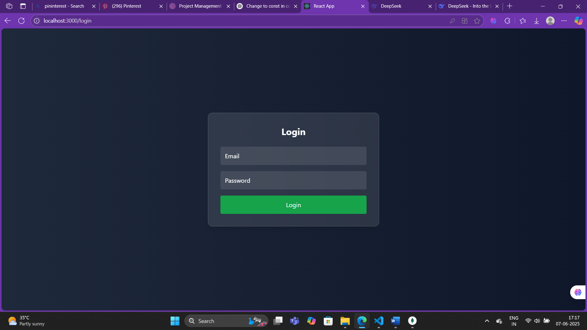
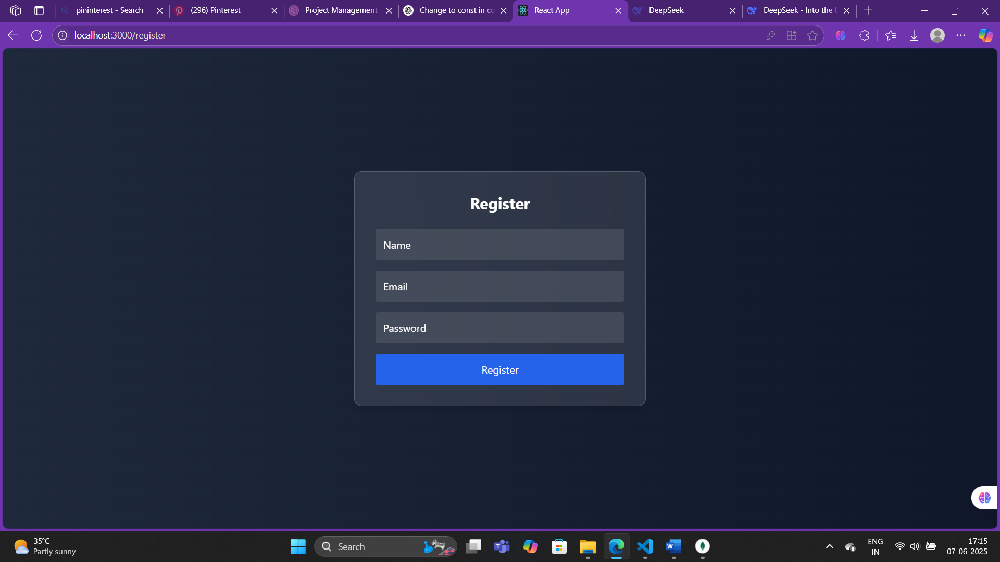
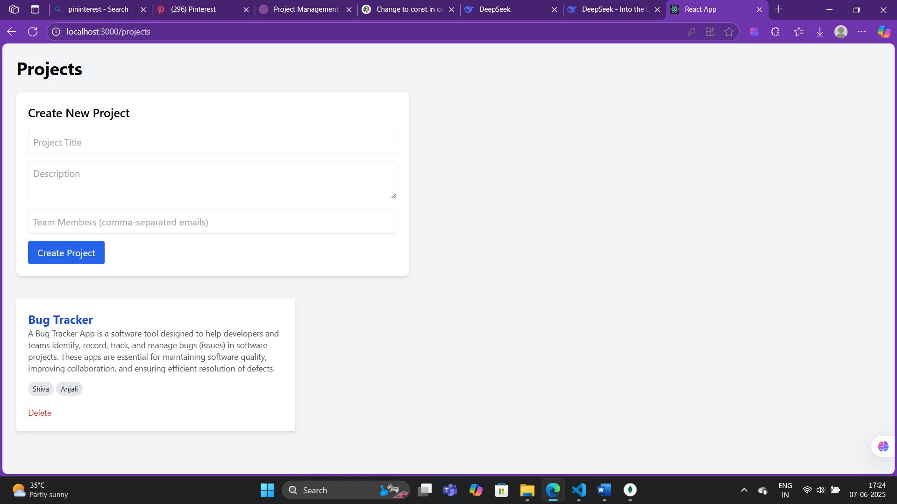
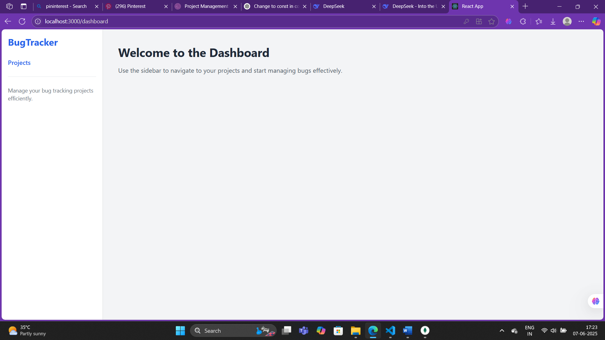

# 🐛 Bug Tracker Web App

A full-stack issue/bug tracker built using the MERN stack (MongoDB, Express, React, Node.js). Inspired by Jira & Linear, this tool helps teams report, assign, track, and resolve bugs via a Kanban workflow.

---

## 🚀 Features

- ✅ JWT-based User Authentication  
- 🧑‍🤝‍🧑 Project and Team Management  
- 🐞 Create & Assign Issues (Tickets)  
- 🏷️ Filter by status, priority, assignee  
- 📋 Drag & drop Kanban Board (To Do, In Progress, Done)  
- 💬 Comments & Collaboration  
- 📎 Optional screenshot uploads  

---

## 📁 Tech Stack

**Frontend:**  
- React.js  
- Tailwind CSS  
- react-beautiful-dnd  
- Axios  

**Backend:**  
- Node.js + Express.js  
- MongoDB + Mongoose  
- JWT + bcrypt  

---

## 📦 Folder Structure

- `/backend`  
  - `models/` — Mongoose schemas (User, Project, Ticket)  
  - `routes/` — Express API routes (auth, projects, tickets)  
  - `controllers/` — Business logic for API endpoints  
  - `middleware/` — Auth and error handling middleware  
  - `index.js` — Express server setup and route mounting  

- `/frontend`  
  - `src/components/` — React components (Login, Dashboard, Kanban, etc.)  
  - `src/pages/` — Page-level components (Home, Projects, Tickets)  
  - `src/context/` — React Context for state management  
  - `src/utils/` — Utility functions and API calls  
  - `tailwind.config.js` — Tailwind CSS configuration  

---

---

## 🛠️ Development Progress

### Day 1 - Splash Screen and Home Page Setup
- Created splash screen with animated title and auto-navigation to home page  
- Developed Home page layout as the initial landing page after splash  
- Set up routing from splash screen to Home page  

#### Screenshots  
  
  

---

### Day 2 - Login and Register Pages
- Built Login and Register forms with validation and state management  
- Implemented frontend routing to `/login` and `/register` pages  
- Added JWT-based authentication integration on login  
- Managed user session and navigation after authentication  

#### Screenshots  
  
  

---

### Day 3 - Project Management Features
- Implemented MongoDB Project schema with title, description, teamMembers fields  
- Added CRUD API routes for Project in backend  
- Built frontend pages and components for listing, creating, updating, and deleting projects  
- Updated Dashboard UI to dynamically reflect selected project data  
- Added sidebar navigation link for Projects page  
- Applied modern UI/UX styling improvements  

#### Screenshots  
  
  

---

Feel free to add or update screenshots in the `/screenshots` folder with matching filenames.

---

## 📦 Installation and Running

(Include your usual setup instructions here...)

---

